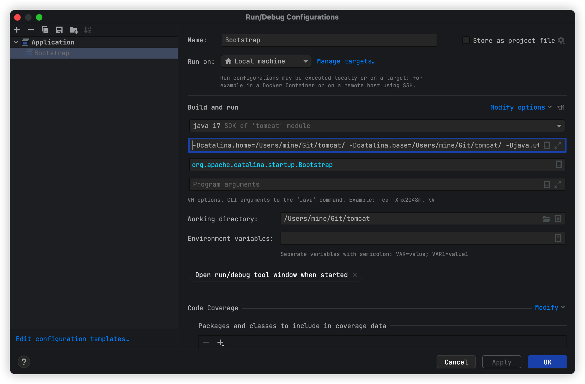

## Tomcat工程是ant构建，此文件是介绍如何用maven构建，对于ant不方便下载依赖的用户，也可以使用maven下载依赖后，再使用ant构建学习。
### 导入工程
* 从Idea中导入tomcat-source工程，如果idea右下角有提示信息，大致为"Maven build scripts found res/maven......modules/openssl-java17Load",不用理会。

### 新建pom.xml文件
* 你可以复制以下代码，直接使用。
* 如果你需要单元测试，自行添加junit依赖。
* 记得将文件名为java的文件夹，标记为Sources Root。
```xml
<?xml version="1.0" encoding="UTF-8"?>
<!--
  Licensed to the Apache Software Foundation (ASF) under one or more
  contributor license agreements.  See the NOTICE file distributed with
  this work for additional information regarding copyright ownership.
  The ASF licenses this file to You under the Apache License, Version 2.0
  (the "License"); you may not use this file except in compliance with
  the License.  You may obtain a copy of the License at

      http://www.apache.org/licenses/LICENSE-2.0

  Unless required by applicable law or agreed to in writing, software
  distributed under the License is distributed on an "AS IS" BASIS,
  WITHOUT WARRANTIES OR CONDITIONS OF ANY KIND, either express or implied.
  See the License for the specific language governing permissions and
  limitations under the License.
-->
<project xmlns="http://maven.apache.org/POM/4.0.0"
         xmlns:xsi="http://www.w3.org/2001/XMLSchema-instance"
         xsi:schemaLocation="http://maven.apache.org/POM/4.0.0
  http://maven.apache.org/xsd/maven-4.0.0.xsd">
  <modelVersion>4.0.0</modelVersion>
  <groupId>org.apache.tomcat</groupId>
  <artifactId>tomcat</artifactId>
  <version>10-0-0-S</version>
  <description>Binary distribution of Apache Tomcat</description>
  <url>https://tomcat.apache.org/</url>
  <dependencies>
    <!-- https://mvnrepository.com/artifact/biz.aQute.bnd/biz.aQute.bndlib -->
    <dependency>
      <groupId>biz.aQute.bnd</groupId>
      <artifactId>biz.aQute.bndlib</artifactId>
      <version>6.2.0</version>
    </dependency>
    <!-- https://mvnrepository.com/artifact/org.apache.ant/ant -->
    <dependency>
      <groupId>org.apache.ant</groupId>
      <artifactId>ant</artifactId>
      <version>1.10.12</version>
    </dependency>
    <dependency>
      <groupId>org.apache.tomcat</groupId>
      <artifactId>jakartaee-migration</artifactId>
      <version>1.0.1-SNAPSHOT</version>
    </dependency>
    <!-- https://mvnrepository.com/artifact/javax/wsdl -->
    <dependency>
      <groupId>wsdl4j</groupId>
      <artifactId>wsdl4j</artifactId>
      <version>1.6.3</version>
    </dependency>
    <!-- https://mvnrepository.com/artifact/javax.xml/jaxrpc -->
    <dependency>
      <groupId>javax.xml</groupId>
      <artifactId>jaxrpc</artifactId>
      <version>1.1</version>
    </dependency>
    <!-- https://mvnrepository.com/artifact/org.eclipse.jdt/ecj -->
    <dependency>
      <groupId>org.eclipse.jdt</groupId>
      <artifactId>ecj</artifactId>
      <version>3.29.0</version>
    </dependency>
  </dependencies>
  <build>
    <plugins>
      <!--跳过单元测试-->
      <plugin>
        <groupId>org.apache.maven.plugins</groupId>
        <artifactId>maven-compiler-plugin</artifactId>
        <version>3.10.1</version>
        <configuration>
          <source>11</source>
          <target>11</target>
        </configuration>
      </plugin>
    </plugins>
    <sourceDirectory>./java</sourceDirectory>

    <resources>
        <!--
     如果没有这一步，会有一些资源加载异常，一些bean实例化失败
     -->
      <resource>
        <directory>src/main/java</directory>
        <includes>
          <include>**/*.xml</include>
          <include>**/*.properties</include>
          <include>**/*.xsd</include>
          <include>**/*.dtd</include>
        </includes>
        <filtering>true</filtering>
      </resource>
    </resources>
  </build>
</project>


```
### JDK
* 我是用的JDK版本是17，leavel是11

### 找到BootStrap类,配置启动参数
* mine 是我的用户名，根据你实际的文件路径进行修改
```text
-Dcatalina.home=/Users/mine/Git/tomcat-source/
-Dcatalina.base=/Users/mine/Git/tomcat-source/
-Djava.util.logging.manager=org.apache.juli.ClassLoaderLogManager
-Djava.util.logging.config.file=/Users/mine/Git/tomcat-source/conf/logging.properties
```


### 手动配置Jsp
* 在类ContextConfig，方法configureStart中添加(添加在webConfig()后面即可)
```java
        context.addServletContainerInitializer(new JasperInitializer(),null);

```
